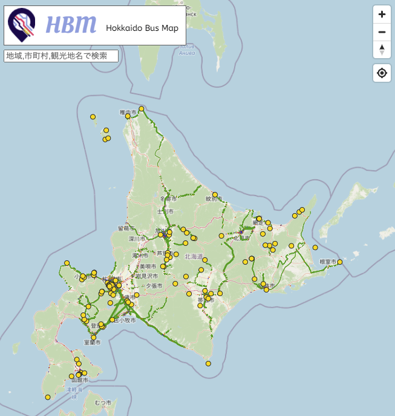

# hokkaido-bus-map

https://hokkaido-bus-map.github.io/



## 概要

-   北海道オープンデータハッカソンで制作されたウェブアプリケーションです

## データ出典

### バスの運行情報

https://www.harp.lg.jp/opendata/dataset/591.html

上記より以下のデータを取得・加工した。

-   北海道北見バス
-   北海道拓殖バス
-   十勝バス
-   網走バス
-   阿寒バス
-   旭川電気軌道
-   北海道中央バス
-   道北バス
-   道南バス
-   ふらのバス
-   函館帝産バス
-   名士バス
-   宗谷バス
-   根室交通
-   函館市電

### 加工について

-   加工には https://github.com/MIERUNE/GTFS-GO を用いた
-   `2021/10/09` に運行している便で集計

### 観光地情報

以下を加工した。

-   https://www.harp.lg.jp/opendata/dataset/606.html
-   https://ckan.hoda.jp/dataset/gtfs-data/resource/b9e5c644-23e1-44c3-bad0-4ce364eb6cb6

### コンビニ

以下を加工した。

-   https://download.geofabrik.de/asia/japan/hokkaido.html

## 本アプリケーションのライセンス

-   MIT License

※出典を明記することで自由に複製・改変できるライセンスです

## 開発者向け情報

### 動作環境

-   Node.js 14.15.5
-   @vue/cli 4.5.11
-   Vue2 + JavaScript

### 環境構築

```sh
# 依存モジュールのインストール
npm install

# 開発サーバー起動
npm run serve

# アプリケーションのビルド
npm run build
```
